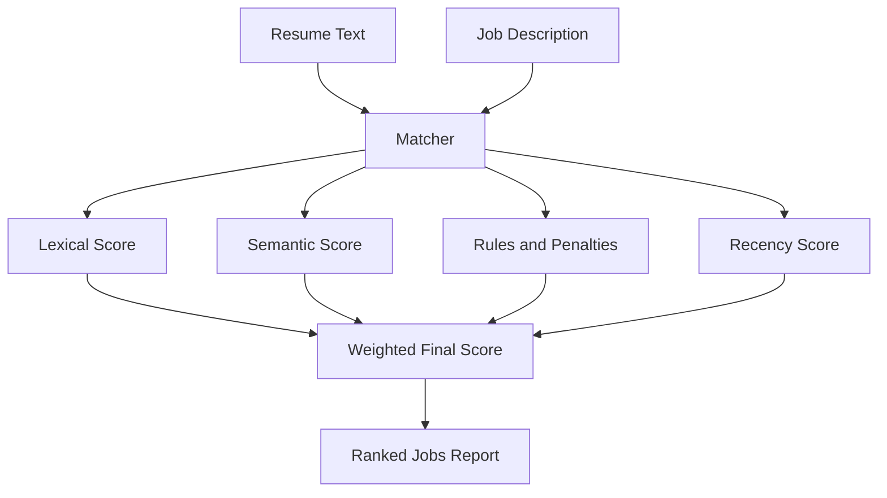
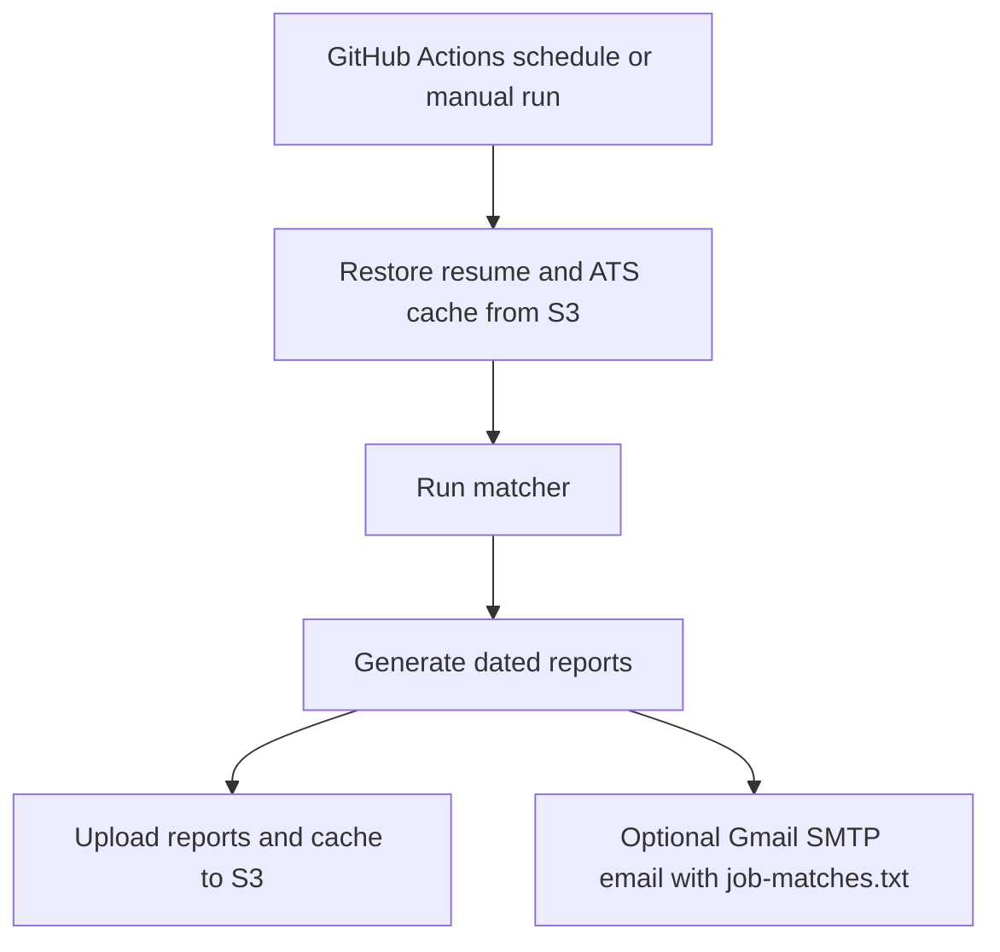

# Job Matcher

A resume-driven job scraping and ranking pipeline for software roles. It scrapes multiple career sites, skips previously seen job URLs, scores only new postings by default, and publishes dated reports for local runs and GitHub Actions.

## Why another Resume Job Matcher?
There are a bunch of resume to job matchers in Github, but I am yet to find one which has a set of job urls with filters that I want that can be configured so that the tool can scrape those.

### But why not just use Indeed/Ziprecruiter or the scores of job search engine?
 - I find stale jobs from these sites occassionally. The career page of each company is perhaps the closest to the truth compared to these job search engine. This tool scrapes from all the career pages that you want to specify.
 - I want to find specifc search terms or absence of those. For example - one may want to find jobs that do not say "US citizen or GC holders only" or "visa sponsorship is not available". Or another one may only want to look at jobs that have such restrictions (perhaps to improve their chances).
 - Semantic searches with one's resume is still poor among many of these job search engines. Some parts of a job description are important to have a good match vs others (like Minimal qualifications vs Preferred qualifications). And parts of a job description perhaps are better for a lexical match rather than semantic.

## What It Does

- Scrapes multiple job board types: `workday`, `greenhouse`, `lever`, `custom`, and `custom-api`. You most likely are going to use custom or custom-api as this helps you configure for each company's careers website.
- Parses a PDF resume
- Scores jobs against the resume using either:
  - `local-hybrid`: local embeddings + lexical overlap + deterministic rules + recency
  - `openrouter`: remote LLM scoring
- Stores results in SQLite so repeated runs avoid re-scraping and re-scoring known URLs
- Generates:
  - `job-matches.txt`
  - `job-matches.json`
- In GitHub Actions:
  - restores the resume and ATS cache from S3
  - writes output into a timestamped folder
  - uploads the latest artifacts back to S3
  - can optionally email the text report via Gmail SMTP

## Matcher Workflow



The matcher combines several signals:

- lexical overlap
- semantic similarity from local embeddings
- deterministic rule-based adjustments
- recency weighting
- penalties for weak required qualifications
- extra penalties when named required technologies are not supported by the resume

The final ATS score is a weighted combination of those signals.

## Automation Flow



## Processing Flow

1. Load config and apply environment overrides.
2. Open the SQLite cache DB and load known job URLs.
3. Parse the resume PDF.
4. Scrape configured job boards.
5. Skip URLs already known in the DB unless recompute logic requires a fresh scrape path.
6. Score jobs.
7. Persist results back to SQLite.
8. Generate text and JSON reports.

## Repository Layout

```text
job-matcher/
├── config/jobs.yaml
├── scripts/
│   ├── job-artifact-paths.js
│   └── send_report_email.py
├── src/
│   ├── ats/ats-scorer.js
│   ├── config/config-loader.js
│   ├── output/report-generator.js
│   ├── parsers/pdf-parser.js
│   ├── scrapers/
│   └── storage/ats-cache-db.js
├── output/
└── package.json
```

## Supported Job Boards

- `workday`
- `greenhouse`
- `lever`
- `custom`
- `custom-api`

## Scoring Modes

### `local-hybrid`
Default mode. No LLM API call is required.

Inputs used in scoring:
- lexical overlap
- local embedding similarity
- rules-based penalties
- recency decay
- required qualifications semantic penalties
- named required technology penalties

Characteristics:
- deterministic enough to tune
- cheaper than LLM scoring
- cached per job URL

### `openrouter`
Uses OpenRouter for score + reasoning generation.

Use this when you want model-generated ATS analysis and are willing to spend API credits.

## Current Scoring Design

The local scorer combines:
- lexical score
- embedding score
- rules score
- recency score

It also applies extra semantic penalties when:
- required qualifications are weakly matched
- required bullets mention concrete technologies not semantically supported by the resume

The built-in technology lexicon is intentionally local and editable. It now includes broader software, data, ML, transformer, and agentic terms plus aliases.

## Caching Behavior

SQLite cache path:
- `job-matcher/output/ats-cache.sqlite`

Cache behavior:
- known job URL: skip re-scoring by default
- new job URL: scrape, score, and store
- `force_recompute: true`: rescore all jobs

"New jobs since last run" in reports means:
- the URL was not already present in the DB when the run started

## Configuration

Primary config file:
- [config/jobs.yaml](/Users/shankr/src/dada/job-matcher/config/jobs.yaml)

Key fields:

```yaml
resume_path: "./resume.pdf"
output_path: "./output/job-matches.txt"
ats_cache_db_path: "./output/ats-cache.sqlite"

llm:
  provider: "local-hybrid"  # or openrouter
  api_key: "${OPENROUTER_KEY}"
  model: "deepseek/deepseek-v3.2"

scoring:
  force_recompute: false
  embedding_model: "BAAI/bge-small-en-v1.5"
```

### Environment Overrides

The app supports runtime overrides via environment variables:
- `JOB_MATCHER_FORCE_RECOMPUTE`
- `JOB_MATCHER_OUTPUT_PATH`

These are used by the GitHub Actions workflow so you do not need to commit YAML changes for one-off runs.

## Local Usage

From `job-matcher/`:

```bash
npm install
node src/index.js
```

Or:

```bash
npm start
```

If you use `openrouter`, provide the key in the environment or `.env`:

```bash
OPENROUTER_KEY=your_key_here
```

## Output

Local default output path in config:
- `job-matcher/output/job-matches.txt`

In GitHub Actions, this is overridden to a dated folder like:
- `job-matcher/output/2026-04-07-1433/job-matches.txt`
- `job-matcher/output/2026-04-07-1433/job-matches.json`

The text report includes:
- summary counts
- new jobs since last run
- ranked listings
- ATS reasoning
- posted date and first-seen timestamps when available

## GitHub Actions

Workflow:
- [job-matcher.yml](/Users/shankr/src/dada/.github/workflows/job-matcher.yml)

It supports:
- scheduled daily runs
- manual runs via `workflow_dispatch`
- manual `force_recompute` input

### Action Inputs

Manual dispatch input:
- `force_recompute` (boolean, default `false`)

### AWS / GitHub Setup

Required GitHub secret:
- `AWS_ROLE_ARN`

Required GitHub variable:
- `JOB_MATCHER_RESUME_S3_KEY`

Optional GitHub variables for email delivery:
- `JOB_MATCHER_EMAIL_TO`
- `JOB_MATCHER_EMAIL_FROM`

Required GitHub secrets for Gmail SMTP:
- `JOB_MATCHER_SMTP_USERNAME`
- `JOB_MATCHER_SMTP_PASSWORD`

### S3 Behavior

The workflow:
- downloads resume PDF from S3
- restores `ats-cache.sqlite` from S3 if present
- runs the matcher
- uploads latest text report, JSON report, and cache DB back to S3

## Email Delivery

The workflow can email `job-matches.txt` through Gmail SMTP.

Requirements:
- set `JOB_MATCHER_EMAIL_TO`
- set `JOB_MATCHER_EMAIL_FROM`
- set `JOB_MATCHER_SMTP_USERNAME`
- set `JOB_MATCHER_SMTP_PASSWORD`
- use a Gmail app password, not the normal Gmail account password
- enable 2-step verification on the Gmail account first

## Custom Board Notes

### `custom`
Use for HTML pages scraped through Puppeteer selectors.

### `custom-api`
Use for JSON-backed career endpoints.

This is useful when a site renders listings from an API and the browser UI is not the real data source.

## Troubleshooting

### Jobs not found
- selector is stale
- page needs a "show more" interaction
- site is using an API rather than static HTML
- Workday DOM variant differs from your existing selectors

### Scores look too generous
- increase semantic penalties for required qualifications
- expand the tech keyword list when a concrete stack term is being missed
- run with `force_recompute` after changing scoring config

### Local embedding issues
- the first run downloads the embedding model
- different models may or may not support quantized ONNX artifacts
- the scorer falls back to non-quantized loading when needed

### GitHub Actions recompute
Use the manual action input instead of editing YAML:
- trigger workflow manually
- set `force_recompute=true`

## Recommended Next Documentation Updates

If this project keeps growing, the next useful split would be:
1. move workflow deployment details into `docs/deployment.md`
2. move custom-board recipes into `docs/boards.md`
3. keep this README as the top-level operational overview
